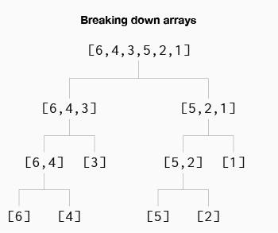
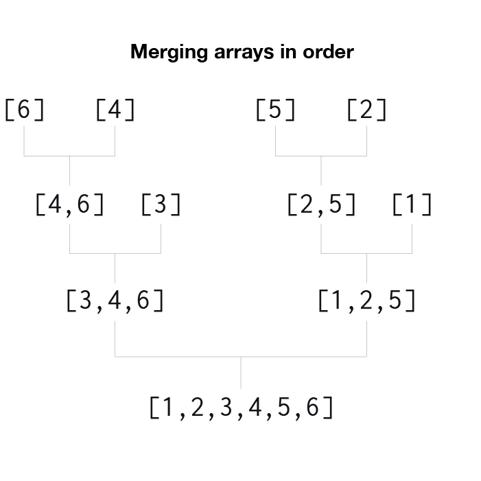
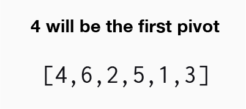
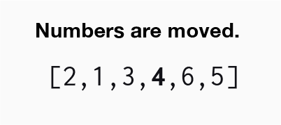
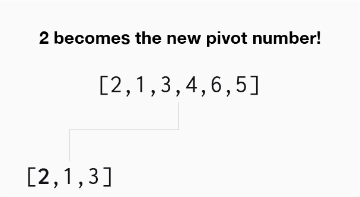

# Sorting_Algorithms

**Sorting is the process of rearranging the items in a collection of data so that the items are in order (smallest to largest, highest to lowest, etc.)**.

When it comes to data, their are many ways to actually sort it. Before sorting the data, the user will need to take into account the present state of the data, the type of data, and the amount of data. Knowing these key factors will depend on the method that is used to actually sort the data.

The types of sorting algorithms that will be discussed in this repository are:

**Basic Sorting Algorithms**
- Bubble Sort
- Selection Sort
- Insertion Sort

**Intermediate Sorting Algorithms**
- Merge Sort
- Quick Sort
- Radix Sort

## Bubble Sort

**Time complexity: O(n)** - Best case | **O(n2)** - Average/worst case

Bubble sort is a sorting algorithm where the largest values "bubble" to the "top" of the data.

## Selection Sort

**Time complexity: O(n)** - Best Case | **O(n2)** - Average/worst case

Selection sort is very similar to bubble sort, the main difference instead of the larger values being places at the top the smallest numbers will be placed at the top of the data.

## Insertion Sort

**Time complexity: O(n)** - Best case | **O(n2)** Average/worst case

Insertion sort works by sorting out the "left" half of the data until completely sorted. For example, if the data is completely unsorted we will start by taking say the lowest number in data set and placing it at the left-most position.

Next, the algorithm will find the second lowest number. Once the second lowest number is found, it will be moved to the left most position available (exactly to the right of the lowest number).

This process will repeat until the data is completely sorted from smallest to largest (left to right respectively).

## Merge Sort

**Time complexity: O(n log(n))**

Merge sort is more complex than the previous three algorithms. Merge sort works by taking an array of data and splitting that array of data down into smaller arrays until each array has a length of one or zero.

Once we have broken down the data into arrays of length zero or one the algorithm will begin to compare all the arrays. Comparing the arrays smaller arrays will help us determine where each value will do in a larger array since all the data will be combined back into one large sorted array.

## Quick Sort

**Time complexity: O(n log(n))** - Best/average case | **O(n2)** - Worst case

Quick sort is similar to merge sort in that it will break down the array of numbers into smaller arrays until the lengths have reach one. To begin breaking down the data, the algorithm chooses a **pivot** value.

In this version, we will select the first number of the array to be the pivot value. After selecting our pivot value, we will run through the rest of the numbers in the array. We will move numbers less than the pivot value to the left of it and numbers largers than the pivot value to the right.

After moving all the numbers, in most cases there will be numbers to the left and numbers to the right of the pivot value. However, just because the values are all less than the pivot number, the numbers are not in the correct order. The numbers are moved in the order that they are read in respectively. This means that all the numbers less than the pivot value need to be sorted.

To begin sorting the numbers less than th pivot number, let's pick a new pivot number.

## Radix Sort

**Time Complexity:**

Radix sort is different than any of the previous sorting algorithms because it sorts data but does not compare number to number. Radix sort exploits the fact tha information about the size of a number is encoded in the number of digits (Example: 200 > 78 = true).

Radix sort begins by looking at all the numbers in a data set. Say we have [1554,6,3554,591,410,4388,900,5,8155,84,9635], the algorithm will look at all of the values in the array. The first pass through the array, the algorithm will look at the **right most digit** of **every value** in the array. The algorithm then sorts the values based on the digit and groups the numbers together.

After each number in the array is sorted by its right-most digit, the algorithm moves on to the next most right digit in the array (exactly one place to the left of the previous digit). The numbers will then be sorted by this digit and placed in there corresponding groupings. If the number is a single digit, then the number is left where it was last moved to.

Radix sort continues to sort the numbers in the groupings until all the digits have been "read" in the number with the most digits.