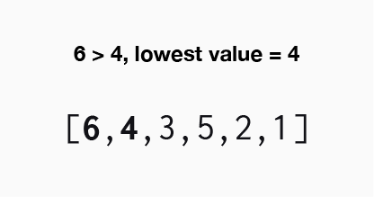
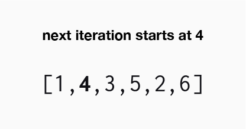
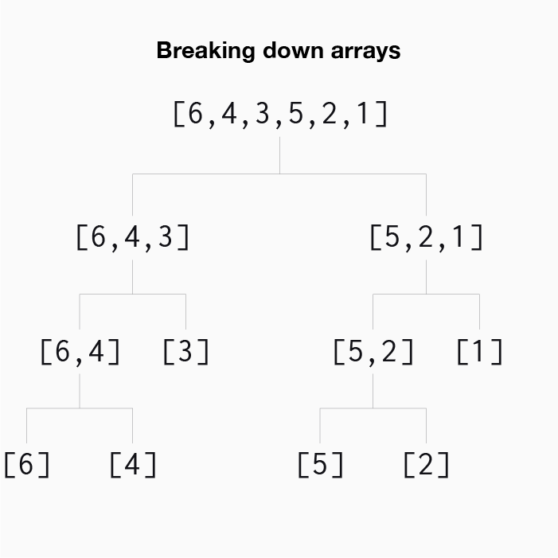
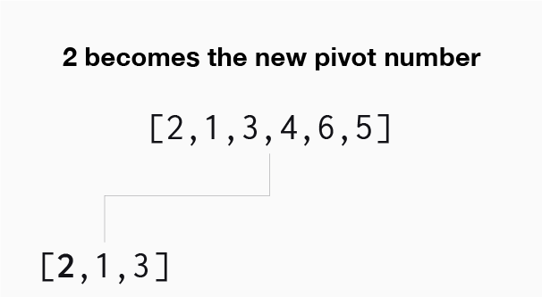
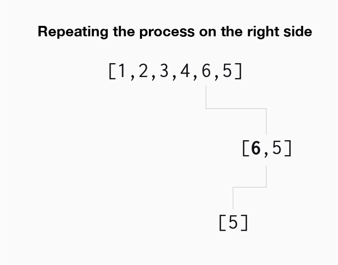
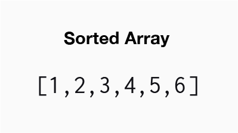

# Sorting_Algorithms

**Sorting is the process of rearranging the items in a collection of data so that the items are in order (smallest to largest, highest to lowest, etc.)**.

When it comes to data, their are many ways to actually sort it. Before sorting the data, the user will need to take into account the present state of the data, the type of data, and the amount of data. Knowing these key factors will depend on the method that is used to actually sort the data.

The types of sorting algorithms that will be discussed in this repository are:

**Basic Sorting Algorithms**
- Bubble Sort
- Selection Sort
- Insertion Sort

**Intermediate Sorting Algorithms**
- Merge Sort
- Quick Sort
- Radix Sort

## Bubble Sort

**Time complexity: O(n)** - Best case | **O(n2)** - Average/worst case

Bubble sort is a sorting algorithm where the largest values "bubble" to the "top" of the data set or in this case, an array. When indexing though an array we looking at the current value of the loop, plus, the value next (directly to the right) of the value.

If the value is larger than the current number of the loop then we swap the two numbers. If the number was less than the current variable the numbers would remain in place.

This process will continue until the first iteraion is complete. In this scenario, since 6 is the largest number in the array, it will be moved all the until the end/top of the array.

Once the algorithm has iterated through the array or made its first pass through it, the algorithm will make another pass to check if the numbers are all in the proper order. If the numbers are not already in order, the algorithm will continue making iterations through the array until all the numbers are in their proper order.

## Selection Sort

**Time complexity: O(n)** - Best Case | **O(n2)** - Average/worst case

Selection sort is very similar to bubble sort, the difference from bubble sort is that selection sort will actually prioritize the smaller values in the array. When selection sort begins iterating through the array it is going to be comparing the current value of the loop (var i) and the next value in the array (var i + 1).

One difference between bubble sort and selection sort is that selection sort does not immediately swap values. Instead if the next value is greater than the current value of the loop (i > (i + 1)), selection sort simply remembers the index of the value.

Now the comparison has been made, index 1 will be saved since this is where the lowest value is currently located. The algorithm now continues its iteration. Three is less than four. The index where three is located will now be saved because it is the lowest current value of this iteration.

Fast forward to the end of the first iteration. The algorithm ends up finding one to be the lowest value in the array and it just so happens to currently be the last value. Once the algorithm has finished its iteration, it needs to place the lowest found value at the beginning of the array. So the swap is made and 1 moves to the beginning of the array and 6 moves the end of the array (which just so happens to be where it will end up entirely).

The algorithm needs to make another iteration through the algorithm and make sure all the values are in the current place. Since one iteration has already been made and we made a switch. The algorithm will not start at the index of zero since that is correct, the algorithm now begins at the index one and continues its iteration.

## Insertion Sort

**Time complexity: O(n)** - Best case | **O(n2)** Average/worst case

Insertion sort works by sorting out the "left" half of the data until completely sorted. Insertion sort starts just like the previous two algorithms (bubble sort and selection sort) where it will compare the first number in the array and second number in the array.

Since four is less than six and the loops is currently at index zero (no established "left" side yet), we make the switch.

After making the swap, the loop is incremeneted and the algorithm is going to compare the numbers six and three. Three is less than six, so the algorithm knows it needs to be moved to the left of six. 

The added step in insertion sort is that once now we will check the left side of six and place three in its correct position.

We discover that three is less than four, so we will move on to the next number. In this example, four is already at index zero, thus, we know that this is where three will go until we discover numbers less than three. Numbers that are less than three will be placed before it in the array.

This process will continue the entire iteration of the array, ending with an array that is sorted in ascending order.

## Merge Sort

**Time complexity: O(n log(n))**

Merge sort is more complex than the previous three algorithms. Merge sort works by taking an array of data and splitting that array of data down into smaller arrays until we have arrays consisting of only one number,

Once we have broken down the data into arrays of single values the algorithm will begin to compare all the arrays. Comparing the smaller arrays will help the algorithm determine where each value will be placed, once all the data is combined back into one large sorted array.

## Quick Sort

**Time complexity: O(n log(n))** - Best/average case | **O(n2)** - Worst case

Quick sort is similar to merge sort in that it will break down the array of numbers into smaller arrays of single values. To begin breaking down the data, the algorithm chooses a **pivot** value.

In this version, the algorithm will select the first value in the array to be the pivot value. After selecting the pivot value, the algorithm will iterate through the rest of the values in the array. The algorithm will move values less than the pivot value to the left of the pivot value and numbers larger than the pivot value to the right.

After moving all the values, in most cases there will be values to the left and values to the right of the pivot value. However, just because the values are all less than the pivot value, the values are not necessarily in the correct order. The values are moved in the order that they are read respectively. This means that all the values less than the pivot value need to be sorted.

To begin sorting the numbers less than th pivot number, the algorithm picks a new pivot number.

Now that a new pivot value has been selected, the algorithm will now repeat the previous step. The valuess less than the new pivot value will be moved to the left, and the values greater than the new pivot value will be moved to the right.

This process will continue to happen until all the valuess less than the original pivot number (original pivot values was four) are sorted out. After sorting all the values less than four, the algorithm will move on to the valuess that were greater than four, repeating the exact same process.

The algorithm will chose the first value greater than four as the new pivot value. The algorithm now reads through the rest of the values greater than four and will determine values less than the new pivot value (6) moving the to the left of it, and numbers greater than the new pivot value movign them to the right. In this example there are no values greater than 6. When 5 is moved to the left of 6, the algorithm is fully sorted.

## Radix Sort

**Time Complexity:**

Radix sort is different than any of the previous sorting algorithms because it sorts data but does not compare value to value. Radix sort exploits the fact tha information about the size of a value is encoded in the number of digits (Example: 200 > 78 = true).

Radix sort begins by looking at all the values in a data set. Say we have **[1554,6,3554,591,410,4388,900,5,8155,84,9635]**, the algorithm will look at all of the values in the array. The first pass through the array, the algorithm will look at the **right most digit** of **every value** in the array. The algorithm then sorts the values based on the digit and groups the numbers together.

After each number in the array is sorted by its right-most digit, the algorithm moves on to the next most right digit in the array (exactly one place to the left of the previous digit). The numbers will then be sorted by this digit and placed in there corresponding groupings. If the number is a single digit, then the number is left where it was last moved to.

Radix sort continues to sort the numbers in the groupings until all the digits have been "read" in the number with the most digits.